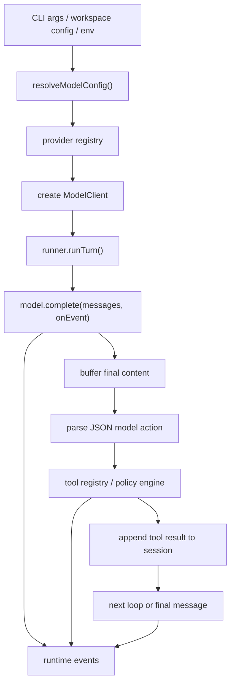

# v0.4.0 Model Provider Runtime Design

**Date:** 2026-04-24  
**Status:** Proposed  
**Target Release:** `v0.4.0`

## 1. Summary

`v0.4.0` upgrades Cliq from a single-provider runtime into a small multi-provider agent runtime with a streaming-capable model layer.

This release adds:

- a provider registry with first-class support for `openrouter`, `anthropic`, `openai`, `openai-compatible`, and local `ollama`
- structured model configuration resolution from CLI, workspace config, environment variables, and defaults
- a static capability model that only admits `text -> text` chat models into the current agent loop
- a streaming-capable model interface plus runtime event stream
- a session schema update so persisted sessions record the actual provider/model identity instead of a single opaque string

This release does **not** change the core Cliq action protocol. The model still returns a complete JSON action payload that the runner parses after completion.

## 2. Why This Release Exists

Cliq `v0.3.0` has two hard architectural limits:

1. runtime model access is hardcoded to `createOpenRouterClient()`
2. there is no streaming abstraction between model transport and runtime UX

That creates the wrong dependency direction:

- CLI decides provider implementation details
- session metadata cannot accurately express runtime identity
- workspace config cannot select the runtime model
- future work such as cost tracking, handoff, headless JSONL, or richer TUI cannot attach to normalized model events

`v0.4.0` fixes that by making model access a runtime subsystem instead of a direct CLI dependency.

## 3. Goals

### 3.1 Product Goals

- Let a user run Cliq against multiple model providers without changing the agent loop.
- Keep the current JSON-over-text action protocol and replay model intact.
- Add streaming in a way that improves runtime observability without leaking raw protocol noise into the default CLI UX.
- Make model/provider selection workspace-aware and session-visible.

### 3.2 Architecture Goals

- Replace direct provider construction in `src/cli.ts` with a provider-agnostic model resolver.
- Add a provider registry that centralizes factory selection, defaults, and validation.
- Normalize provider outputs into a small model runtime contract.
- Create a runtime event stream that future TUI/RPC surfaces can reuse.

## 4. Non-Goals

`v0.4.0` explicitly excludes:

- cross-provider handoff
- dynamic remote model discovery as a required runtime path
- cost and token accounting
- provider-native tool calling
- image, audio, or video generation
- non-text model outputs in the main agent loop
- parsing and executing tool calls incrementally while the model is still streaming
- showing raw token-by-token JSON action text in the default CLI output

These are deferred because they either require a different protocol shape or a more mature session/event model.

## 5. User-Facing Behavior

### 5.1 CLI Surface

Cliq gains model selection flags:

```bash
cliq --provider openrouter --model anthropic/claude-sonnet-4.6 "fix the failing test"
cliq --provider anthropic --model claude-sonnet-4-5 "inspect the repo"
cliq --provider openai --model gpt-5 "explain this file"
cliq --provider openai-compatible --base-url http://localhost:4000/v1 --model my-model "run the task"
cliq --provider ollama --model qwen3:14b "review this code"
```

Initial flag set:

- `--provider <name>`
- `--model <id>`
- `--base-url <url>`

Policy flags and skill flags remain unchanged.

### 5.2 Workspace Config

`.cliq/config.json` gains an optional `model` block:

```json
{
  "model": {
    "provider": "ollama",
    "model": "qwen3:14b",
    "baseUrl": "http://localhost:11434"
  }
}
```

This config is advisory and local to the workspace.

### 5.3 Environment Variables

Selection env vars:

- `CLIQ_MODEL_PROVIDER`
- `CLIQ_MODEL`
- `CLIQ_MODEL_BASE_URL`

Credential env vars:

- `OPENROUTER_API_KEY`
- `ANTHROPIC_API_KEY`
- `OPENAI_API_KEY`
- `CLIQ_MODEL_API_KEY` for `openai-compatible` by default

`ollama` does not require an API key by default.

### 5.4 Resolution Order

The runtime resolves model config in this order:

1. CLI flags
2. `.cliq/config.json`
3. environment variables
4. built-in defaults

Built-in defaults for `v0.4.0`:

- provider: `openrouter`
- model: `anthropic/claude-sonnet-4.6`
- base URL:
  - `openrouter`: `https://openrouter.ai/api/v1`
  - `anthropic`: `https://api.anthropic.com`
  - `openai`: `https://api.openai.com/v1`
  - `ollama`: `http://localhost:11434`
  - `openai-compatible`: no implicit remote default beyond explicit `baseUrl`

Provider-specific model defaults when `provider` is set but `model` is omitted:

- `openrouter`: `anthropic/claude-sonnet-4.6`
- `anthropic`: `claude-sonnet-4-20250514`
- `openai`: `gpt-5.2`
- `openai-compatible`: no default, explicit `model` is required
- `ollama`: no default, explicit `model` is required

## 6. Streaming UX Boundary

Streaming is included in `v0.4.0`, but only as a runtime transport and event capability.

The default CLI must **not** print raw model deltas if those deltas are internal JSON action text such as:

```json
{"bash":"npm test"}
```

That would expose protocol internals and degrade the agent UX.

Therefore `v0.4.0` uses this rule:

- provider adapters may stream deltas
- the runner buffers streamed text into a final string
- the runner emits high-level runtime progress events
- the default CLI renderer shows model progress and tool lifecycle, not raw streamed JSON tokens

This creates a correct base for later richer UIs while preserving the current protocol.

## 7. Design Overview

### 7.1 New Concepts

#### Provider Name

```ts
type ProviderName =
  | 'openrouter'
  | 'anthropic'
  | 'openai'
  | 'openai-compatible'
  | 'ollama';
```

#### Model Capabilities

`v0.4.0` introduces model metadata, but only to support safe admission into the current runtime.

```ts
type ModelCapabilities = {
  input: Array<'text' | 'image' | 'audio' | 'video'>;
  output: Array<'text' | 'image' | 'audio' | 'video'>;
  streaming: boolean;
  reasoning: boolean;
  toolCalling: boolean;
  contextWindow?: number;
  maxOutputTokens?: number;
};
```

The runtime only allows models whose capabilities include:

- `input` contains `text`
- `output` contains `text`

Everything else is metadata for future releases.

#### Model Descriptor

```ts
type ModelDescriptor = {
  provider: ProviderName;
  model: string;
  displayName: string;
  capabilities: ModelCapabilities;
};
```

#### Resolved Model Config

```ts
type ResolvedModelConfig = {
  provider: ProviderName;
  model: string;
  baseUrl?: string;
  apiKey?: string;
  streaming: 'auto' | 'on' | 'off';
};
```

Streaming resolution semantics:

- `auto`: use streaming when the adapter and endpoint support it
- `on`: require streaming, fail if the endpoint cannot stream
- `off`: disable streaming even when the provider supports it

### 7.2 Why Static Capabilities Instead Of Dynamic Discovery

Dynamic discovery is deliberately postponed.

Reasons:

- provider schemas differ substantially
- model metadata is often incomplete or unstable across APIs
- network-dependent startup would make local CLI behavior brittle
- it is unnecessary for the first multi-provider release

`v0.4.0` therefore ships with a **static descriptor set** for built-in defaults and a **generic fallback profile** for explicit user-provided model ids.

Fallback rule:

- if a model id is explicitly provided but not present in the built-in descriptor table, Cliq may still use it
- unknown explicit models are treated as minimally compatible `text -> text` models for providers that expose chat-style text APIs
- this is especially important for `ollama`, where local model names vary widely

## 8. Architecture

### 8.1 Module Layout

New or expanded modules:

- `src/model/types.ts`
- `src/model/config.ts`
- `src/model/registry.ts`
- `src/model/providers/openrouter.ts`
- `src/model/providers/anthropic.ts`
- `src/model/providers/openai.ts`
- `src/model/providers/openai-compatible.ts`
- `src/model/providers/ollama.ts`
- `src/model/events.ts`
- `src/runtime/events.ts`

Updated modules:

- `src/cli.ts`
- `src/workspace/config.ts`
- `src/session/types.ts`
- `src/session/store.ts`
- `src/runtime/runner.ts`

### 8.2 Provider Registry

The provider registry owns:

- provider name validation
- client factory lookup
- default base URLs
- credential lookup rules
- static default model descriptors

It does **not** own:

- CLI parsing
- session persistence
- tool execution

Conceptually:

```ts
type ModelProvider = {
  name: ProviderName;
  supportsStreaming: boolean;
  defaultBaseUrl?: string;
  createClient(config: ResolvedModelConfig): ModelClient;
  getDefaultModel(): string;
  getKnownModels(): ModelDescriptor[];
};
```

### 8.3 Model Config Resolver

The model config resolver reads:

- CLI args
- workspace config
- environment variables
- provider registry defaults

And returns a `ResolvedModelConfig`.

This module is the only place where precedence rules live.

### 8.4 Model Client Contract

`ModelClient` becomes structured and streaming-aware.

```ts
type ModelMessage = {
  role: 'system' | 'user' | 'assistant';
  content: string;
};

type ModelStreamEvent =
  | { type: 'start'; provider: ProviderName; model: string }
  | { type: 'text-delta'; text: string }
  | { type: 'end' }
  | { type: 'error'; message: string };

type ModelCompletion = {
  content: string;
  provider: ProviderName;
  model: string;
};

type ModelClient = {
  complete(
    messages: ModelMessage[],
    options?: {
      onEvent?: (event: ModelStreamEvent) => void | Promise<void>;
    }
  ): Promise<ModelCompletion>;
};
```

Rationale:

- one method keeps the runner simple
- streaming is optional via `onEvent`
- non-streaming providers can still emit `start` and `end`

### 8.5 Runtime Event Stream

The runner exposes runtime-level events distinct from raw model deltas.

```ts
type RuntimeEvent =
  | { type: 'model-start'; provider: ProviderName; model: string; streaming: boolean }
  | { type: 'model-progress'; chunks: number; chars: number }
  | { type: 'model-end'; provider: ProviderName; model: string }
  | { type: 'tool-start'; tool: string; preview?: string }
  | { type: 'tool-end'; tool: string; status: 'ok' | 'error' }
  | { type: 'final'; message: string }
  | { type: 'error'; stage: 'model' | 'protocol' | 'policy' | 'tool'; message: string };
```

Important boundary:

- `ModelStreamEvent` may contain raw delta text
- `RuntimeEvent` must not expose internal JSON action text in the default path

This separation is what allows streaming without protocol leakage.

### 8.6 Session Schema Update

Current sessions only store:

```ts
model: string;
```

That is no longer sufficient. `v0.4.0` upgrades session model identity to:

```ts
type SessionModelRef = {
  provider: ProviderName;
  model: string;
  baseUrl?: string;
};
```

Session shape becomes:

```ts
type Session = {
  version: 4;
  app: 'cliq';
  model: SessionModelRef;
  cwd: string;
  createdAt: string;
  updatedAt: string;
  lifecycle: SessionLifecycle;
  records: SessionRecord[];
};
```

Migration rules:

- legacy string `model` values migrate to:
  - `provider: 'openrouter'`
  - `model: <legacy-string>`
- existing records remain unchanged

This keeps replay stable while making future handoff and observability possible.

## 9. Provider-Specific Behavior

### 9.1 OpenRouter

- Uses chat completions over OpenRouter HTTP API.
- Requires `OPENROUTER_API_KEY`.
- Supports streaming.
- Default model remains `anthropic/claude-sonnet-4.6`.

### 9.2 Anthropic

- Uses Anthropic Messages API.
- Requires `ANTHROPIC_API_KEY`.
- Supports streaming.
- Model ids are Anthropic-native.

### 9.3 OpenAI

- Uses chat completions in `v0.4.0` for interoperability and minimal adapter complexity.
- Requires `OPENAI_API_KEY`.
- Supports streaming.

### 9.4 OpenAI-Compatible

- Uses the OpenAI chat completions wire format.
- Requires explicit `baseUrl`.
- Uses `CLIQ_MODEL_API_KEY` unless later overridden by explicit config.
- Supports streaming if the remote endpoint supports it.

### 9.5 Ollama

- Uses Ollama native API, not OpenAI compatibility mode.
- Default base URL is `http://localhost:11434`.
- Does not require an API key by default.
- Supports streaming.
- Accepts arbitrary local model ids, for example `qwen3:14b`.

## 10. Data Flow



## 11. Error Handling

### 11.1 Config Errors

Hard fail before runner start:

- unknown provider
- missing required API key
- missing `baseUrl` for `openai-compatible`
- model config with unsupported capability profile

### 11.2 Transport Errors

Each provider adapter normalizes:

- timeout
- network failure
- non-2xx HTTP response
- malformed JSON
- malformed stream frames

Into normal `Error` values that the runner can record as model-stage failures.

### 11.3 Streaming Errors

If streaming fails mid-response:

- the adapter surfaces an error
- the runner emits `RuntimeEvent { type: 'error', stage: 'model' }`
- the turn fails normally

There is no partial tool execution from partial streamed content.

## 12. Testing Strategy

### 12.1 Unit Tests

- CLI arg parsing for `--provider`, `--model`, `--base-url`
- workspace config parsing and validation for `model`
- model config precedence resolution
- provider registry lookup and validation
- session migration from string model to structured model ref
- streaming parser tests per provider adapter
- runner emits runtime events in the expected order
- runner buffers streamed output and only parses after completion

### 12.2 Integration Tests

- fake streaming client that emits multiple deltas, then a valid JSON action
- fake non-streaming client that still fits the same runner path
- CLI renderer receives runtime events without printing raw JSON deltas

### 12.3 Acceptance Tests

`v0.4.0` only counts as shipped if all following are true:

- a workspace can select `openrouter` via config or CLI
- a workspace can select `anthropic` via config or CLI
- a workspace can select `openai` via config or CLI
- a workspace can select `openai-compatible` with explicit `baseUrl`
- a workspace can select local `ollama`
- existing action loop behavior still works end-to-end
- session persistence records structured provider/model identity
- streaming-enabled providers emit runtime progress events without leaking raw JSON action text in default CLI mode

## 13. Rollout Notes

### 13.1 Versioning

- release target: `v0.4.0`
- session schema target: `v4`

### 13.2 Backward Compatibility

- old sessions migrate automatically
- old workspaces without model config continue to work via default OpenRouter config
- action protocol remains unchanged

## 14. Deferred Follow-Ups

These become easier after `v0.4.0`, but are not part of it:

- token and cost accounting
- `cliq models` command and cached dynamic model refresh
- structured headless event output for JSONL/RPC
- cross-provider handoff
- provider-native tools
- raw streamed final-answer rendering once the protocol grows a separate final-text path

## 15. Recommendation

Ship `v0.4.0` as the first release where Cliq can honestly be described as:

- a provider-agnostic local agent runtime
- a streaming-capable runtime kernel
- still intentionally protocol-minimal

Do **not** expand scope beyond this. The correct next step after `v0.4.0` is to exploit the new event and provider boundaries, not to overload this release with handoff, discovery, native tools, or multimedia APIs.
